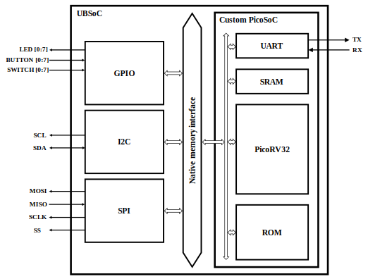
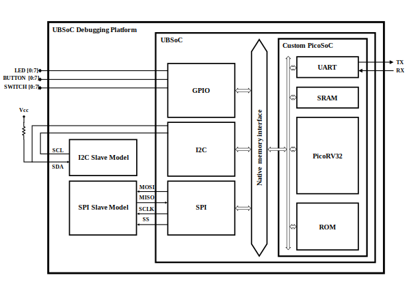

UbSoC - Implementación de PicoSoC en una DE0-nano
==================================================



Es una modificación y una ampliación del [PicoSoC](https://github.com/YosysHQ/picorv32/tree/master/picosoc) de Claire Wolf

La implementación se ha realizado en una DE0-nano.

El equipo de [SymbiFlow](https://github.com/SymbiFlow/symbiflow-arch-defs/tree/master/tests/9-soc/picosoc) lo modificó para que no requiera una flash SPI externa. En su lugar, el programa se almacena en la ROM que se implementa en la FPGA.

El contenido de la ROM se almacena en el archivo `progmem.v`. Éste se genera a partir del uso del script Python `hex2progmem.py` desde un archivo HEX.

** ATENCIÓN ** Debido a la modificación de la memoria, esta implementación no funciona con el conjunto de instrucciones comprimido de RISC-V. El PicoRV32 está configurado como RV32IM.

### Sistema de archivos

| Archivo                                                                                       | Descripción                                                         |
| --------------------------------------------------------------------------------------------- | ------------------------------------------------------------------- |
| [rtl/ubsoc.v](rtl/ubsoc.v)                                                                    | Top-level del UbSoC                                                |
| [rtl/ubsoc_debug.v](rtl/ubsoc_debug.v)                                                        | Top-level de la plataforma de test del UbSoC                       |
| [rtl/picosoc noflash/picosoc_noflash.v](rtl/picosoc\_noflash/picosoc\_noflash.v)              | Top-level del PicoSoC modificado con la ROM                         |
| [rtl/picosoc noflash/picorv32.v](rtl/picosoc\_noflash/picorv32.v)                             | Núcleo PicoRV32 del sistema                                         |
| [rtl/picosoc noflash/simpleuart.v](rtl/picosoc\_noflash/simpleuart.v)                         | Módulo de UART para comunicación con el PC                          |
| [rtl/picosoc noflash/progmem.v](rtl/picosoc\_noflash/progmem.v)                               | Memoria ROM generada a partir del código C                          |
| [rtl/i2c module/i2c_master_top.v](rtl/i2c\_module/i2c\_master\_top.v)                         | Top-Level del módulo I2C                                            |
| [rtl/i2c module/i2c_master_byte_ctrl.v](rtl/i2c\_module/i2c\_master\_byte\_ctrl.v)            | Controladora de flujo de bytes del módulo I2C                       |
| [rtl/i2c module/i2c_master_bit_ctrl.v](rtl/i2c\_module/i2c\_master\_bit\_ctrl.v)              | Controladora de flujo de bits del módulo I2C                        |
| [rtl/spi module/spi_master_top.v](rtl/spi\_module/spi\_master\_top.v)                         | Top-Level del módulo SPI                                            |
| [rtl/spi module/spi_master_registers.v](rtl/spi\_module/spi\_master\_registers.v)             | Registros del módulo SPI                                            |
| [rtl/spi module/spi_master_controller.v](rtl/spi\_module/spi\_master\_controller.v)           | Controladora de TX/RX del módulo SPI                                |
| [rtl/spi module/spi_gray_counter.v](rtl/spi\_module/spi\_gray\_counter.v)                     | Contador de código Gray del módulo SPI                              |
| [firmware/firmware.c](firmware/firmware.c)                                                    | Código fuente en C del firmware para implementar en la FPGA         |
| [firmware/firmware_tb.c](firmware/firmware\_tb.c)                                             | Código fuente en C del firmware para simular                        |
| [firmware/hex2progmem.py](firmware/hex2progmem.py)                                            | Script para generación de la ROM con el firmware grabado            |
| [InstallEnvironment](InstallEnvironment.sh)                                                   | Bash de instalación de entorno de trabajo                           |

### Mapa de memoria


| Direcciones              | Descripción                             |
| -----------------------: | --------------------------------------- |
| 0x00000000 .. 0x00FFFFFF | SRAM interna                            |
| 0x01000000 .. 0x01FFFFFF | ROM interna                             |
| 0x02000000 .. 0x02FFFFFF | Registros UART                          |
|               0x02000004 | Registro Divisor de reloj UART          |
|               0x02000008 | Registros TX/RX de UART                 |
| 0x03000000 .. 0x03FFFFFF | Registros GPIO                          |
|               0x03000000 | Registros de LEDs                       |
|               0x03000100 | Registro de botones e interruptores     |
| 0x04000000 .. 0x04FFFFFF | Nuevos periféricos                      |
| 0x05000000 .. 0x05FFFFFF | Registros SPI                           |
|               0x05000000 | Registro Control SPI                    |
|               0x05000200 | Registro Buffer de transmisión SPI      |
|               0x05000300 | Registro Selección de esclavo SPI       |
|               0x05000400 | Registro Prescala de reloj SPI          |
|               0x05010000 | Registro Buffer de recepción SPI        |
|               0x05010100 | Registro Estado SPI                     |
| 0x06000000 .. 0x06FFFFFF | Memory mapped user peripherals          |
|               0x06000000 | Registro Prescala Bajo de reloj I2C     |
|               0x06000100 | Registro Prescala Alto de reloj I2C     |
|               0x06000200 | Registro Control I2C                    |
|               0x06000300 | Registro Transmisión I2C                |
|               0x06000400 | Registro Comando I2C                    |
|               0x06010000 | Registro Recepción I2C                  |
|               0x06010100 | Registro Estado I2C                     |
| 0x07000000 .. 0xFFFFFFFF | Nuevos periféricos                      |

Los rangos de direcciones asignados sólo implica que están reservados para ese propósito, no necesariamente están todas las direcciones llenas.

Las lecturas a direcciones de memoria superiores a las de la SRAM física, éstas se direccionan a la memoria ROM.

Las solicitudes de acceso a direciones de memoria superiores a las de la ROM, se direccionan a los registros de los módulos que correspondan.

### Preparación del entorno de trabajo
Los siguientes pasos están definidos para Ubuntu (nativo o WSL). La ejecución de todos ellos se debe hacer como superusuario.

```
sudo -s
```

Añadimos los nuevos repositorios para la instalación de las dependencias necesarias.
```
apt install software-properties-common --assume-yes
add-apt-repository ppa:ubuntu-toolchain-r/test --yes
add-apt-repository ppa:deadsnakes/ppa --yes
```
Actualizamos las listas del gestor de paquetes.
```
apt-get update --assume-yes
apt-get upgrade --assume-yes
```
Instalamos las dependencias del sistema.
```
apt-get install autoconf automake autotools-dev curl libmpc-dev libmpfr-dev libgmp-dev libusb-1.0-0-dev gawk build-essential bison flex texinfo gperf libtool patchutils bc zlib1g-dev git device-tree-compiler pkg-config libexpat-dev zlib1g-dev libexpat1-dev --assume-yes
apt-get install python python3.11 --assume-yes
```
Instalamos la última versión del compilador GCC y G++, y la configuramos como predeterminada.
```
apt install gcc-11 g++-11 --assume-yes
update-alternatives --install /usr/bin/gcc gcc /usr/bin/gcc-11 100 --slave /usr/bin/g++ g++ /usr/bin/g++-11 --slave /usr/bin/gcov gcov /usr/bin/gcov-11
update-alternatives --config gcc
```
Creamos los directorios donde se instalarán los binarios de la toolchain de RISC-V y otorgamos permisos para modificarlos.
```
mkdir /opt/riscv32i
chown $USER /opt/riscv32i
mkdir /opt/riscv32im
chown $USER /opt/riscv32im
```
Descargamos el repositorio de la toolchain de RISC-V de 32 bits. 
** Este proceso puede tardar mucho rato, dependiendo de la conexión a internet que tengamos. La toolchain ocupa varios GB **

Descargamos el repositorio de la toolchain de RISC-V GCC.
```
git clone https://github.com/riscv/riscv-gnu-toolchain riscv-gnu-toolchain-rv32i
cd riscv-gnu-toolchain-rv32i
git submodule update --init --recursive
```
Construimos la toolchain para RV32I.
```
mkdir build_i; cd build_i
../configure --prefix=/opt/riscv32i --with-arch=rv32i --with-abi=ilp32
make -j$(nproc)
cd ..
```
Realizamos este mismo paso para la toolchain RV32IM, cambiando el directorio a `build_im`, y a `--prefix=/opt/riscv32im` y `--with-arch=rv32im`.

Añadimos permanentemente los binarios de la toochain en el PATH del sistema.
```
export PATH=$PATH:/opt/riscv32i/bin/:/opt/riscv32im/bin/
echo 'export PATH=$PATH:/opt/riscv32i/bin/:/opt/riscv32im/bin/' >> ~/.profile
```
Todos estos pasos están automatizados en el bash `InstallEnvironment.sh` para simplificar todo el proceso. Debemos ejecutar:
```
bash InstallEnvironment.sh
```
Este bash también incluye la también las toolchain para RV32IC y RV32IMC. 

### Generación de memoria ROM

En la carpeta `/rtl/picosoc_noflash` se encuentra la memoria ROM `progmem.v` ya generada con el `firmware.c`.

En caso de realizar modificaciones en el firmware, dentro de la carpeta `/firmware` ejecutamos `make all` para complilar el firmware en C y escribirlo en un módulo ROM verilog llamado `progmem.v` que será el que se instanciará en el PicoSoC modificado.

El firmware está configurado para un reloj de sistema de 50MHz y los valores de los registro de prescalado del I2C y del SPI están establecido para ese reloj. En caso de cambiar la frecuencia del reloj del sistema, se deberán reajustar los valores de estos registros.

Para la compilación del firmware se utiliza la toolchain de RV32IM.

### Testbench

En la carpeta `/testbench` están los modelos de esclavo de I2C y SPI. Además están los testbench independientes de estos módulo, y también el de la plataforma de test `UbSoC-debug` en los que se integran los esclavos y el UbSoC.

Para simular el UbSoC utilizaremos la ROM `progmem_tb.v` donde está escrito el firmware reducido para el testbench. La diferencia con el otro es que los menús se han reducido a `print()` con strings muy sencillas sólo para ubicarnos dentro de la simulación, evitando grandes tiempos de simulación en los menús.

### Síntesis

Tanto `UbSoC` como `UbSoC-debug` son totalmente sintetizables. 

Para poder sintetizar la plataforma `UbSoC-debug` en Quartus II hay que incluir todos los archivos de la carpeta `/rtl` y los modelos de esclavos que hay en la carpeta `/testbench`. 

Para utilizar el SoC en un proyecto personal sólo hay que añadir la carpeta `/rtl` y utilizar como Top-Level el `UbSoC`.

El reloj del sistema está configurado a 50MHz (la frecuencia máxima de la DE0-nano), con lo que hay que crear un reloj en Quartus II de esta frecuencia y en el Pin Planner hay que asignar a la entrada `clk_i` el pin R8.

El resto de pines se deben asignar del siguiente modo:

| I/O                | Pin       |
| ------------------ | --------- |
| clk_i              | PIN_R8    |
| gpio_button_i[1]   | PIN_E1    |
| gpio_button_i[0]   | PIN_J15   |
| gpio_led_o[7]      | PIN_L3    |
| gpio_led_o[6]      | PIN_B1    |
| gpio_led_o[5]      | PIN_F3    |
| gpio_led_o[4]      | PIN_D1    |
| gpio_led_o[3]      | PIN_A11   |
| gpio_led_o[2]      | PIN_B13   |
| gpio_led_o[1]      | PIN_A13   |
| gpio_led_o[0]      | PIN_A15   |
| gpio_switch_i[3]   | PIN_M15   |
| gpio_switch_i[2]   | PIN_B9    |
| gpio_switch_i[1]   | PIN_T8    |
| gpio_switch_i[0]   | PIN_M1    |
| i2c_scl_mst_o      | PIN_J13   |
| i2c_scl_slv_i      | PIN_J14   |
| i2c_sda_mst_io     | PIN_J16   |
| i2c_sda_slv_io     | PIN_K15   |
| suart_rx_i         | PIN_A3    |
| suart_tx_o         | PIN_C3    |

Quedaran I/Os sin pines asignados debido a que la DE0-nano no tiene ni más botones ni más pulsadores que los asignados. Para otras placas con más recursos hardware, estas I/Os se podrán asignar.



### Ejecución

Una vez cargado el proyecto en la FPGA se necesitarán cierto componentes hardware para terminar la conexión de la plataforma `UbSoC-debug`.

Hay que conectar los pines `SCL` del maestro y del esclavo entre sí y los pines `SDA` del maestro y del esclavo deben conectarse con una resistencia en pull-up a Vcc de 3.3V.

Además para comunicarse e interactuar junto con el PC, hay que conectar los pines de la UART a un conversor UART-USB. 

Una vez conectado todo podemos utilizar una terminal serie (en nuestro caso hemos utilizado Putty) para comunicarnos.

```

             ______   _______  _______  _______ 
   |\     /|(  ___ \ (  ____ \(  ___  )(  ____ \
   | )   ( || (   ) )| (    \/| (   ) || (    \/
   | |   | || (__/ / | (_____ | |   | || |      
   | |   | ||  __ (  (_____  )| |   | || |      
   | |   | || (  \ \       ) || |   | || |      
   | (___) || )___) )/\____) || (___) || (____/\
   (_______)|/ \___/ \_______)(_______)(_______/                                          


A fork of PicoSoC (Clifford Wolf)
by Omar Romera


   [1] Pinout Map
   [2] Pinout List
   [3] GPIO testbench
   [4] I2C testbench
   [5] SPI testbench

Select option>
```


### Agradecimientos


Este proyecto ha sido posible gracias a:
* Claire Wolf, su [PicoRV32](https://github.com/YosysHQ/picorv32) y su [PicoSoC](https://github.com/YosysHQ/picorv32/tree/master/picosoc).
* Richard Hevielle, su [módulo master I2C](https://opencores.org/projects/i2c) y su [modelo esclavo SPI](http://www.opencores.org/projects/simple_spi/) 
* Steve Fielding y su [modelo esclavo I2C](https://opencores.org/projects/i2cslave).
* Joan Canals y su módulo SPI.
* Lawrie Griffiths y su [TinySoC](https://github.com/lawrie/tiny_soc), que ayudó a la comprensión de la interfaz de memoria del PicoSoC.
* Equipo de SymbiFlow y su [modificación del PicoSoC](https://github.com/SymbiFlow/symbiflow-arch-defs/tree/master/tests/9-soc/picosoc), que elimina la dependencia de éste con la memoria flash externa.
* Juan Gonzalez-Gomez y su [implementación del PicoSoC](https://github.com/Obijuan/mynotes/wiki/2018-oct-17-picorv32-test), que ayudó a la instalación de la toolchain de RISC-V.
* Todas aquellas personas cercanas que me acompañaron durante el desarrollo del proyecto.
